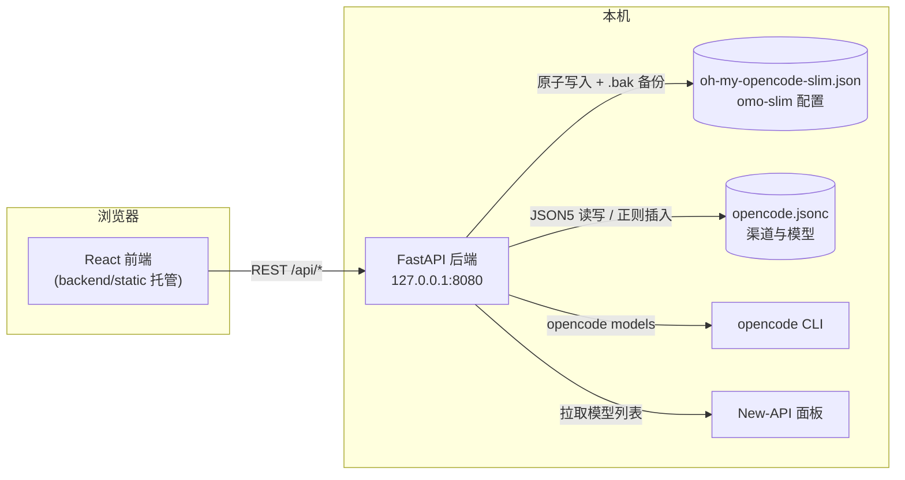

<div align="center">

# Slim Config

**为 [OpenCode](https://opencode.ai) 的 `oh-my-opencode-slim` 插件提供的图形化配置界面**

告别手写 JSON —— 用可视化的方式管理 Agent、Preset、模型渠道与 Companion 动画

`FastAPI` · `React 19` · `Vite` · `TypeScript` · `Tailwind CSS`

</div>

---

## 目录

- [功能特性](#功能特性)
- [架构总览](#架构总览)
- [环境要求](#环境要求)
- [OpenCode 版本兼容性](#opencode-版本兼容性)
- [快速开始（Windows）](#快速开始windows)
- [快速开始（Linux / macOS）](#快速开始linux--macos)
- [前端开发模式](#前端开发模式)
- [构建前端](#构建前端)
- [配置文件说明](#配置文件说明)
- [命令行参数](#命令行参数)
- [API 总览](#api-总览)
- [安全说明](#安全说明)
- [常见问题](#常见问题)
- [License](#license)

## 功能特性

| 功能 | 说明 |
| --- | --- |
| **Preset 预设管理** | 为不同使用场景创建多套 Agent 模型分配方案，一键切换激活 |
| **自定义 Agent** | 可视化增删改查自定义 Agent 及其模型绑定 |
| **多源模型聚合** | 合并 `opencode.jsonc` 静态配置与 `opencode models` CLI 输出，统一下拉选择 |
| **New-API 差异同步** | 拉取 New-API 面板最新模型，Diff 对比后勾选注入，正则插入**完整保留 JSONC 注释** |
| **智能校验** | 保存前拦截：致命错误（结构损坏）与非致命警告（如 observer 角色建议视觉模型）分级提示 |
| **Companion 伙伴动画** | 调整页面虚拟伙伴的位置、大小与动画播放速度 |
| **模型元数据** | 自动识别模型视觉（vision）能力与推理等级，辅助选型 |

## 架构总览

经典前后端分离架构：前端只负责交互与草稿状态，所有文件 I/O、跨进程调用与远端请求均由后端完成。



## 目录结构

```
slim-config/
├── backend/
│   ├── main.py              # FastAPI 服务入口（含全部 REST API）
│   ├── slim_config.py       # omo-slim 配置的读取、原子写入与校验
│   ├── opencode_reader.py   # opencode.jsonc 解析、模型聚合、New-API 同步
│   ├── model_metadata.py    # 模型元数据（vision 检测、推理等级）
│   ├── static/              # 前端构建产物（npm run build 自动生成）
│   └── requirements.txt     # Python 依赖
├── frontend/                # React + Vite + TypeScript + Tailwind 源码
│   └── copy-build.js        # 构建后自动复制 dist → backend/static
├── skills/                  # AI 辅助开发技能文档
├── start.bat                # Windows 一键启动（CMD）
├── start.ps1                # Windows 一键启动（PowerShell）
├── start.sh                 # Linux / macOS 一键启动
├── FRONTEND.md              # 前端开发文档（API 规范）
└── project_summary.md       # 项目全景总结
```

## 环境要求

| 组件 | 版本 | 必需性 |
| --- | --- | --- |
| Python | 3.10+ | 必需（运行后端） |
| Node.js | 20+ | 仅构建/开发前端时需要 |
| OpenCode | **1.17+（仅 v1.x）**，见[版本兼容性](#opencode-版本兼容性) | 可选（启用 `opencode models` 模型聚合） |
| New-API 面板 | — | 可选（启用模型同步功能） |

> 仓库已内置 `backend/static/` 前端构建产物，**普通用户无需安装 Node.js** 即可使用。

## OpenCode 版本兼容性

> **当前版本仅适配 OpenCode 1.x，不支持 OpenCode v2（2.x）。**

| OpenCode 版本 | 支持情况 | 说明 |
| --- | --- | --- |
| 1.17.x | ✅ 开发验证基准 | omo-slim 插件基于 `@opencode-ai/plugin@1.17.13` 插件 API 构建 |
| 1.18.x | ✅ 推荐 | 1.x 系列当前维护线（最新 v1.18.34），以缺陷修复为主 |
| v2（2.x，当前 2.0.6） | ❌ 暂不支持 | v2 重构了 provider 配置 schema，详见下文 |

### 为什么暂不支持 v2

OpenCode v2 对 provider 配置做了破坏性重构，与本项目和 omo-slim 插件依赖的 1.x 格式不兼容：

| 配置项 | OpenCode 1.x（本项目适配） | OpenCode v2 |
| --- | --- | --- |
| 顶层字段 | `provider`（单数） | `providers`（复数） |
| 端点 / 密钥 | `provider.<id>.options.baseURL` / `options.apiKey` | `providers.<id>.settings.baseURL` / `settings.apiKey` |
| CLI 分发包 | `npm i -g opencode-ai` | `npm i -g @opencode/cli`（独立安装脚本 / `opencode-v2` brew tap） |
| 部分 provider ID | `google-vertex-anthropic` 等 | v2 直接拒绝，强制使用新 ID |

受影响的功能：

- **模型列表读取**：后端从 `opencode.jsonc` 的 `provider`（单数）节点读取渠道与模型，在 v2 格式下读取结果为空
- **New-API 同步**：依赖 `provider.new-api.options.baseURL/apiKey` 定位远端面板，并按 1.x 结构注入模型，v2 下无法定位配置节点
- **omo-slim 插件**：基于 1.x 插件 API 开发，在 v2 插件运行时中的兼容性尚未验证
- **不受影响**：`oh-my-opencode-slim.json` 的读写（presets / agents / companion）是纯文件操作，不依赖 OpenCode 版本，但需要能正常加载 omo-slim 插件才有意义

v2 适配计划：待 omo-slim 插件确认 v2 插件 API 兼容性后，让后端同时识别 `provider` / `providers` 双格式。如你在 v2 下遇到问题，欢迎提交 issue 反馈。

## 快速开始（Windows）

### 方式一：一键启动（推荐）

```powershell
git clone https://github.com/Yeecean/slim-config.git
cd slim-config

# 首次使用先安装依赖
pip install -r backend/requirements.txt

start.bat        # CMD 环境用这个
# 或
.\start.ps1      # PowerShell 环境用这个
```

启动后浏览器会自动打开 `http://127.0.0.1:8080`。

### 方式二：手动启动

```powershell
git clone https://github.com/Yeecean/slim-config.git
cd slim-config

pip install -r backend/requirements.txt
python backend\main.py                 # 默认 http://127.0.0.1:8080

# 自定义端口示例
python backend\main.py --port 8081
```

## 快速开始（Linux / macOS）

### 方式一：一键启动（推荐）

```bash
git clone https://github.com/Yeecean/slim-config.git
cd slim-config
chmod +x start.sh
./start.sh                    # 自动创建 .venv 虚拟环境并安装依赖

# 参数原样透传给后端，例如：
./start.sh --port 8081
```

`start.sh` 会自动完成：检查 `python3` → 创建项目级虚拟环境 `.venv`（规避发行版的 PEP 668 限制）→ 安装依赖 → 启动服务。

### 方式二：手动启动

```bash
git clone https://github.com/Yeecean/slim-config.git
cd slim-config

python3 -m venv .venv
source .venv/bin/activate
pip install -r backend/requirements.txt
python3 backend/main.py               # 默认 http://127.0.0.1:8080
```

> 无桌面环境的服务器上，启动时的自动打开浏览器会静默跳过，手动访问 `http://127.0.0.1:8080` 即可。

## 前端开发模式

前后端可分开启动，Vite dev server 已将 `/api` 代理到后端 `127.0.0.1:8080`：

```bash
# 终端 1：后端
cd backend
pip install -r requirements.txt
python main.py

# 终端 2：前端热更新
cd frontend
npm install
npm run dev
```

浏览器访问 `http://localhost:5173`（前端），API 请求自动转发到 8080。

## 构建前端

修改前端代码后，将构建产物发布到后端：

```bash
cd frontend
npm install
npm run build
```

`tsc -b && vite build` 完成后，`copy-build.js` 会自动清空并覆盖 `backend/static/`，无需手动复制。

## 配置文件说明

所有配置文件默认位于 OpenCode 配置目录：

- **Linux / macOS**：`~/.config/opencode/`
- **Windows**：`%USERPROFILE%\.config\opencode\`

| 文件 | 权限 | 说明 |
| --- | --- | --- |
| `oh-my-opencode-slim.json` | 读写 | omo-slim 插件配置（presets / agents / companion）。本工具的主要写入目标：写入前自动生成 `.bak` 备份，采用「临时文件 + 原子替换」防止写入中断导致损坏 |
| `opencode.jsonc` | 读写 | OpenCode 主配置（provider 渠道与模型）。以 JSON5 解析；New-API 同步通过正则插入新模型，**不破坏已有注释** |
| `auth.json` | 不接触 | OpenCode 自身的 API 密钥文件，本工具不会读取或修改 |

自定义配置目录的两种方式：

```bash
# 方式一：命令行参数
python backend/main.py --config-dir /path/to/opencode

# 方式二：环境变量
export SLIM_CONFIG_DIR=/path/to/opencode       # Linux/macOS
set SLIM_CONFIG_DIR=D:\path\to\opencode        # Windows CMD
```

## 命令行参数

| 参数 | 默认值 | 说明 |
| --- | --- | --- |
| `--port` | `8080` | 监听端口 |
| `--host` | `127.0.0.1` | 监听地址（保持默认仅本机访问） |
| `--config-dir` | `~/.config/opencode` | OpenCode 配置目录 |

## API 总览

后端同时提供 OpenAPI 文档：启动后访问 `http://127.0.0.1:8080/docs` 在线调试所有接口。

统一响应格式：

```jsonc
// 成功
{ "ok": true, "data": { ... } }
// 失败
{ "ok": false, "error": "中文错误描述" }
```

| 方法 | 路径 | 说明 |
| --- | --- | --- |
| GET | `/api/status` | 服务状态与配置路径 |
| GET | `/api/providers` | 聚合后的 Provider 与模型列表 |
| GET | `/api/providers/sync/diff` | 与 New-API 的模型差异对比 |
| POST | `/api/providers/sync/apply` | 应用勾选的新增模型（保留注释） |
| POST | `/api/providers/sync/remove` | 移除已失效模型 |
| GET | `/api/models/{provider}/{model}` | 单个模型元数据（vision 等） |
| GET / PUT | `/api/config` | 读取 / 合并保存 omo-slim 配置 |
| GET / PUT | `/api/opencode-config` | 读取 / 保存 `opencode.jsonc` |
| POST | `/api/validate` | 保存前校验（返回致命错误与警告） |
| GET / POST | `/api/presets` | 列出 / 创建 Preset |
| PUT / DELETE | `/api/presets/{name}` | 更新 / 删除 Preset |
| PUT | `/api/active-preset` | 切换激活的 Preset |
| GET / PUT | `/api/agents`、`/api/agents/{name}` | 自定义 Agent 管理 |
| GET / PUT | `/api/companion` | Companion 动画配置 |
| POST | `/api/shutdown` | 优雅关闭后端服务 |

## 安全说明

- 服务默认仅监听 `127.0.0.1`，属于本机工具。**请勿**使用 `--host 0.0.0.0` 暴露到公网：后端 CORS 全开且无鉴权，任何能访问该端口的人都可以修改你的 OpenCode 配置。
- 所有配置与 API 密钥均保存在本地用户目录中，本仓库不包含任何密钥或敏感信息。
- 修改 `opencode.jsonc` 属于高风险操作：`oh-my-opencode-slim.json` 有自动备份，而 `opencode.jsonc` 的整文件保存（`PUT /api/opencode-config` 传 `parsed` 时）会丢失注释，建议优先使用「raw」保存或 New-API 同步功能。

## 常见问题

<details>
<summary><b>启动时报端口被占用</b></summary>

换一个端口启动：`python backend/main.py --port 8081`，或结束占用 8080 的进程。
</details>

<details>
<summary><b>Windows 终端中文乱码</b></summary>

`start.bat` 已自动执行 `chcp 65001`（UTF-8）。手动运行出现乱码时，先执行 `chcp 65001` 再启动即可。
</details>

<details>
<summary><b>提示「无法连接 New-API」</b></summary>

检查 `opencode.jsonc` 中 `provider.new-api.options` 的 `baseURL` 与 `apiKey` 是否配置正确，并确认面板服务在线。
</details>

<details>
<summary><b>Linux 上 pip 安装报 externally-managed-environment 错误</b></summary>

新版 Debian/Ubuntu/Fedora 禁止直接向系统 Python 安装包。使用 `./start.sh`（自动创建虚拟环境），或手动执行 `python3 -m venv .venv && source .venv/bin/activate` 后再安装。
</details>

<details>
<summary><b>模型下拉列表缺少某些模型</b></summary>

列表由两部分合并：`opencode.jsonc` 中静态配置的模型 + `opencode models` CLI 输出。确认 OpenCode CLI 已安装且在 PATH 中；CLI 调用失败时仅显示静态配置部分。
</details>

<details>
<summary><b>保存后想撤销修改</b></summary>

`oh-my-opencode-slim.json` 每次写入前都会在同目录生成 `.bak` 备份，直接用它覆盖回原文件即可。
</details>

## License

[MIT](LICENSE) © 2026 Yeecean
